<h1 align="center">Treasure of Mazar</h1>

## Introduction
Treasure of Mazar is a Python based text adventure game designed for a command line interface (CLI). In the Treasure of Mazar, the player must adventure through an ancient tomb to claim the fabled treasure within. There are multiple choices that the player can make to aid them in their adventure, including challenges such as riddles and puzzles. The game is aimed at users who wish to play a simple and fun text adventure with multiple paths and endings based on user choice.

[The live site can be accessed here.](https://treasure-of-mazar.herokuapp.com/)

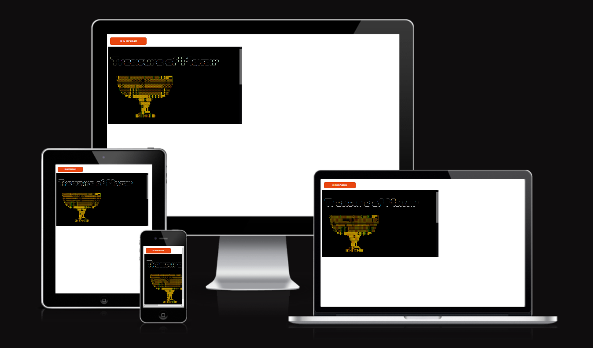

## Table of Contents

1. [Site Goals](#site-goals)
    - [User Stories](#user-stories)
    - [Site Owner Goals](#site-owner-goals)
2. [Design](#design)
    - [Colours](#colours)
    - [Images](#images)
    - [Flow Chart](#flow-chart)
3. [Features](#features)
    - [Existing Features](#existing-features)
    - [Future Features](#future-features)
4. [Technologies](#technologies)
5. [Testing](#testing)
    - [Validator Testing](#validator-testing)
    - [Feature Testing](#feature-testing)
    - [Responsiveness](#responsiveness)
    - [Known Bugs](#known-bugs)
6. [Deployment](#deployment)
    - [Local Deployment](#local-deployment)
7. [Credits](#credits)
    - [Content](#content)
    - [Media](#media)

## Site Goals

### User Stories

- As a new user, I want to be able to play a text adventure game.
- As a new user, I want to know how to play the game.
- As a new user, I want to play the game without any errors.
- As a new user, I want the story to be enticing.
- As a new user, I want to progress through the game easily.
- As a returning user, I want to try different paths and decisions.
- As a returning user, I want to get different endings.

### Site Owner Goals

- As a site owner, I want to create a fun and simple text adventure game.
- As a site owner, I want to be able give the user multiple options for progression.
- As a site owner, I want the game to be easy to understand.
- As a site owner, I want the game to be replayable.
- As a site owner, I want the game to flow well from one scene to another. 

## Design

### Colours
I used mostly default colours of the CLI through the game as I didn't want to overwhelm or confuse the user with too much colour. However, I did use colours for the ASCII art and for when certain events happened, such as different characters speaking. This was done to draw the users attention to these areas and also differentiate them from the player's speech.

- __Examples:__

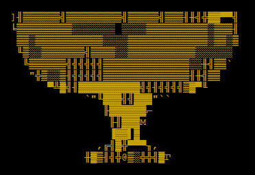
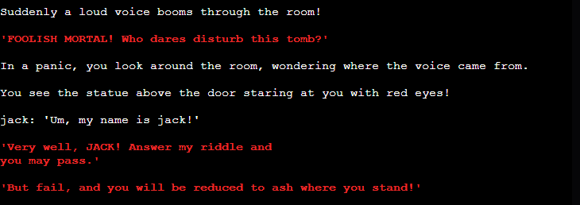

### Graphics
I chose to include some ASCII art in the game to make it more appealing. This was done using a free ASCII generator from the website, [patorjk](https://patorjk.com) for text, and [asciiart](https://asciiart.club/) for images. I only chose to use the ASCII art for the introduction and death screen. This was because I didn't want to overwhelm users with graphics in a text based game, and feel that imagining the situations works better than displaying graphics.

Title

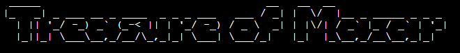

Chalice

Death

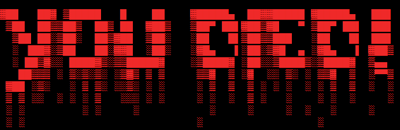

### Flow Chart
I created the flow chart for the game using [Lucidchart](https://www.lucidchart.com/pages/). This helped me to plan out the flow of the game and the amount of user input that I would need to include.

Flow Chart

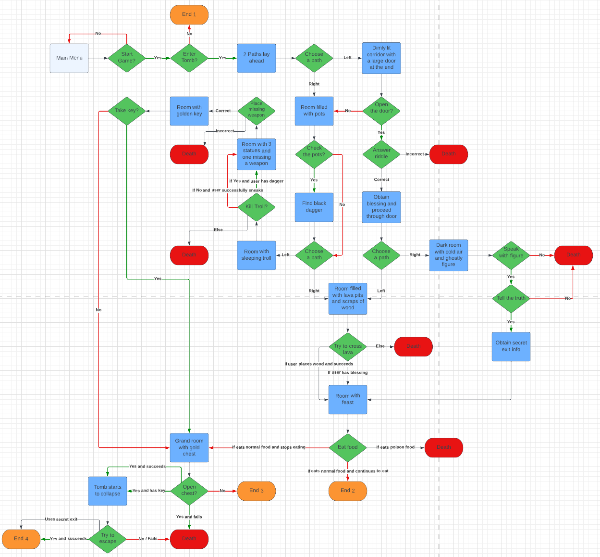

## Features

### Existing Features

- __Introduction__
    - This is the first thing the user is met with when they run the game.
    - It provides a title of the game and a graphic of the treasure.
    - The premise of the game is introduced and the user is asked if they wish to read the instructions.

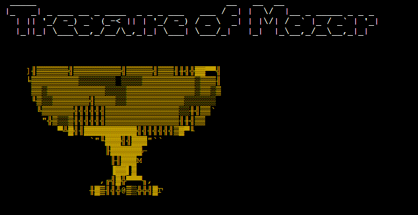

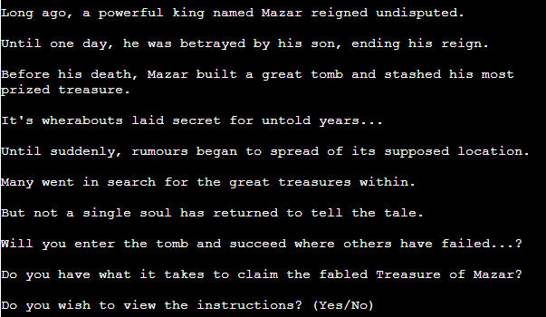

- __Instructions__
    - Before the game starts the user is asked if they wish to view the instructions.
    - Displays instructions on how the game is played.

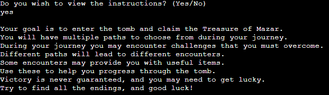

- __Name Choice__
    - The player is asked to choose a name for their character, allowing the story to be more personalised.
    - The player name is also displayed when the player character talks.

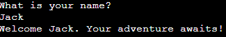

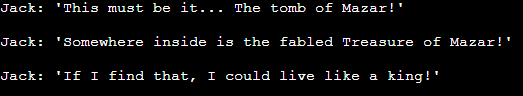

- __Path choices__
    - There are 5 main paths that the player can choose to take.
    - These paths are chosen when the player reaches a crossroad in the tomb.
    - Path 1 takes the player to a room with a large door.
    - Path 2 takes the player to a room filled with pots.
    - Path 3 takes the player to a cold room with an ominous presence. This can only be accessed from Path 1.
    - Path 4 takes the player to a room with a sleeping troll. This can only be accessed to path 2.
    - Path 5 takes the player to a room with lava pits. This can be accessed from both Path 1 and Path 2.

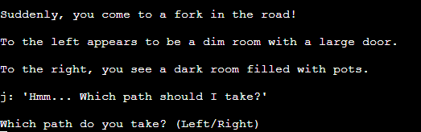

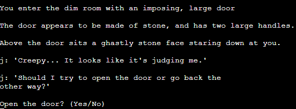

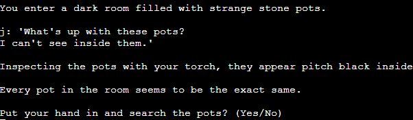

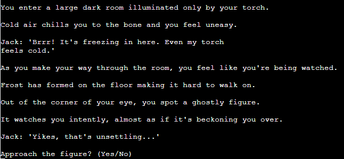

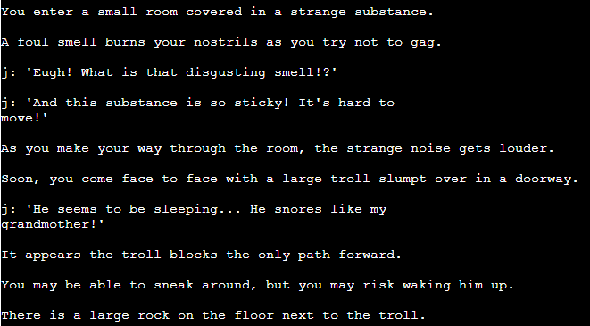

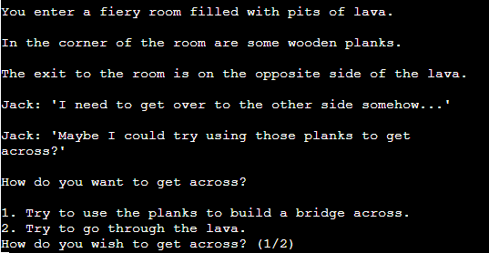

- __Player items and attributes__
    - The player can find items and obtain attributes through the game to help them progress.
    - Items and attributes are single use and allow them a guaranteed pass in a room.

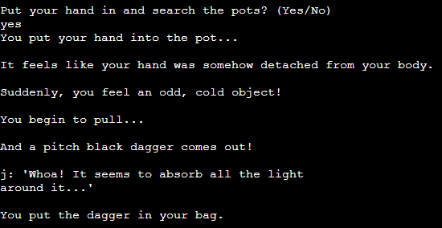

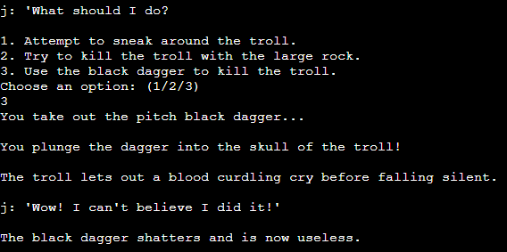

- __Random Elements__
    - There are random elements in the game which can determine if a player wins or not.
    - A statue room has randomised weapon combos from a list.
    - The riddles for the door in path 1 are randomised from a list.
    - Certain actions in the game are randomised and have a chance of failing or succeeding.

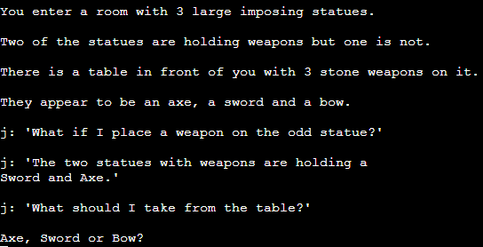

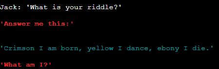

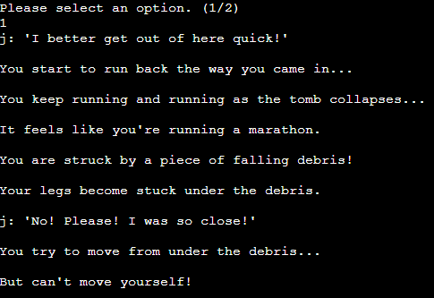

- __Death Screen__
    - When the player dies the death screen is displayed.
    - An option to try again is presented to the user.

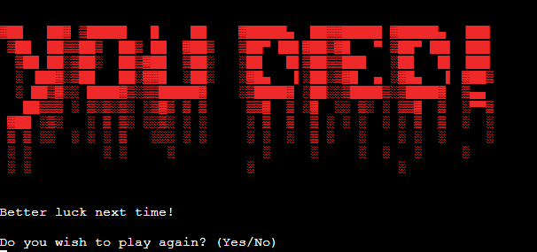

- __End Screens__
    - There are a total of 4 endings in the game.
    - Each ending displays a different end banner and title, and a different story sequence.

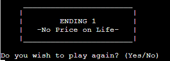

- __Input Validation__
    - All input is validated to check that it matches the options presented.
    - If an input does not match the presented options, a statement is printed asking the user to enter their choice again.
    - The users choice of name is also validated to make sure it is not too long or too short.

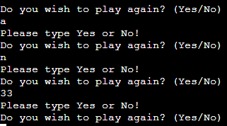

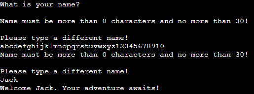

### Future Features

- Game Sounds
    - I feel that adding sounds to the game would be a good way to improve the user experience. For example, a chime sound could play when the user enters a correct answer which would give them audio feedback that they answered correctly. Also sounds could play when the timer is low to let the user know that they are running low on time.

- Leaderboards
    - I would like to add a leaderboard which keeps a record of high scores and allows the user to enter their name to display ther score in the leaderboard. This could make the game more attractive to competetive players who wish to aim for the highest spot on the leaderboard.

- Game start on typing
    - I would like to make the game start when the user starts to type in the text box rather than using a start button. This would make starting the game more fluid as the user can just use their keyboard to start the game, rather than clicking on a button.

## Technologies

- HTML5 - Used for the structure and content of my web pages.
- CSS3 - Used for the styling of pages.
- JavaScript - Used to implement the interactive features of the site and create the main functionality of the game.
- [Font Awesome](https://fontawesome.com/) - For the timer icon used in the games.
- [Google fonts](https://fonts.google.com/) - Used to choose the fonts for my site.
- [favicon.io](https://favicon.io/) - Used to create the favicon for the site.
- [Gitpod](https://www.gitpod.io/) - Used as my code editor.
- [GitHub](https://github.com/) - Used for deploying and hosting my site.

## Testing

### Validator Testing

- HTML
    - No errors displayed when checking with the W3C markup validation service.

- CSS
    - No errors displayed when checking with the W3C CSS validation service.

- Google Lighthouse
    - Google lighthouse gave the site a score of 100 for all categories except performance, which was shown as 90 for mobile and 99 for desktop.

- JSHint
    - JSHint only displayed one warning about declaring functions in loops, but this is required in the project to enable the buttons to operate correctly.

### Feature Testing

- Buttons
    - I tested that all buttons operate as they should, by repeatedly clicking them, refreshing the page and clicking again and trying on different devices. I tested that the 'start' button would disable until the user finishes the current game before it is enabled again.

- Timer
    - I tested the timer by running the game and checking its initial value was set. I then checked that it decremented every second and would stop at 0. I would run the game multiple times to check that it performed this function every time. I also used the menu button to return to the main menu and then checked the game again to see if the timer had stopped. I tested that the different game modes and difficulty displayed the correct starting time.

- Score
    - I tested that the score would increase whenever the user typed a word correctly. I made sure that everytime the user starts a new game, the score would set to 0. I checked that the score would set to 0 when the user left the game and that it would not break if they left before the game finished. I checked that the high score was being correctly set when the user score was higher than the value in local storage. I checked that the high score for each game mode was being set to the high score for the specific mode and difficulty in local storage. I checked that the high score would be set to 0 if no previous records of the high score were present.

- Increase timer in countdown
    - I tested that the timer increases by 2 seconds whenever the user score increases in countdown. I tested this for each difficulty.

- Words randomise
    - I tested that a new word is displayed randomly whenever the user plays the game. I tested that a correct match between the user input and random word would clear the user input box and randomise the word again. I tested that a new random word is displayed whenever the user loads the game or refreshes the page.

### Responsiveness

- To test my site for responsiveness on different screen sizes I used Mozilla Firefox and Google Chrome Dev tools to emulate different size viewports. The smallest viewport size that I tested my site on was 320x480.
- I tested in both portrait and landscape modes to ensure that the site functioned as intended when in different view modes.
- My personal device (Samsung Galaxy S20 Ultra 5G) was also used in both portrait and landscape modes to test the site.

### Known Bugs

- When clicking the start button on mobile devices the #btn-start:hover styles do not correctly get deselected when the button is disabled, causing them to be active until the user clicks somewhere else on the page.

## Deployment

I deployed my site to GitHub pages using the following steps:
  1. Select project2_speedy_typer from my GitHub dashboard, navigate to the Settings tab 
  2. From the 'Code and automation' left menu, select pages
  3. From the source section select the main branch in the drop down menu, select save
  4. Once the main branch has been saved, the GitHub pages section will display a message saying that the site is ready to be published at https://jackday94.github.io/project2_speedy_typer/
  5. After waiting for a few minutes and refreshing the page, GitHub pages will now display a messaging saying 'Your site is published at https://jackday94.github.io/project2_speedy_typer/'
  6. The site is now deployed and can be viewed using the provided link

### Local Deployment

To deploy my project locally the following steps can be used:
1. Navigate to my Github account and locate and select the 'project2_speedy_typer' repository 
2. At the top of the repository, next to the green Gitpod button, select the 'code' button
3. Download the ZIP file of the repository
4. When the ZIP file has finished downloading, extract the contents to a relevant folder on your device
5. The website can then be run locally on your device

## Credits

### Content

- Instructions on handling the DOM content and event listeners were taken from [Code Institute course material](https://codeinstitute.net/)
- The clock icon for the timer was obtained from [Font Awesome](https://fontawesome.com/)
- Information for various elements in HTML, CSS and JS and how to use them were often taken from [W3Schools](https://www.w3schools.com/)
- Information on how to store and get values from local storage were taken from [stackoverflow](https://stackoverflow.com/questions/29370017/adding-a-high-score-to-local-storage)
- JavaScript tutorials and tricks on how to implement a game were obtained from useful guides on the youtube channel [Traversy Media](https://www.youtube.com/c/TraversyMedia)

### Media
- The background image of the site was taking from the free stock photo library [Pexels](https://www.pexels.com/)
- The favicon for the site was generated using [favicon.io](https://favicon.io/)
- To find colours that contrasted well with each other and give me the look for my site that I was after, I used [Coolors](https://coolors.co/)
