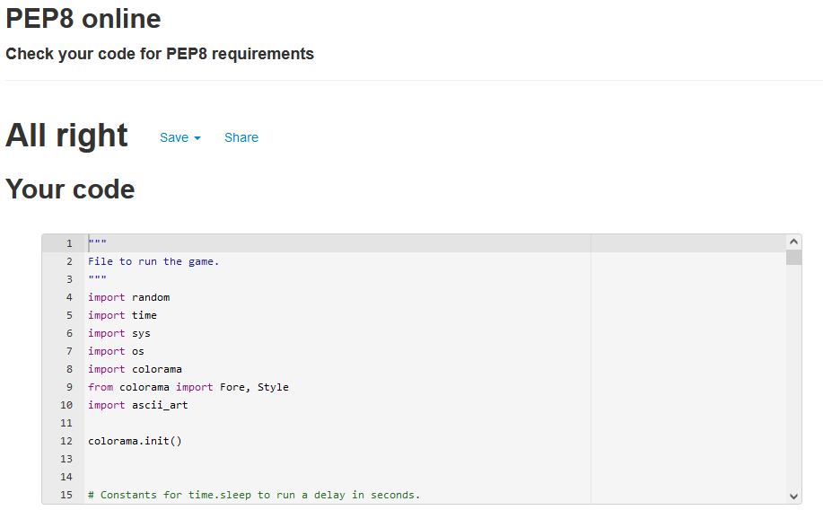
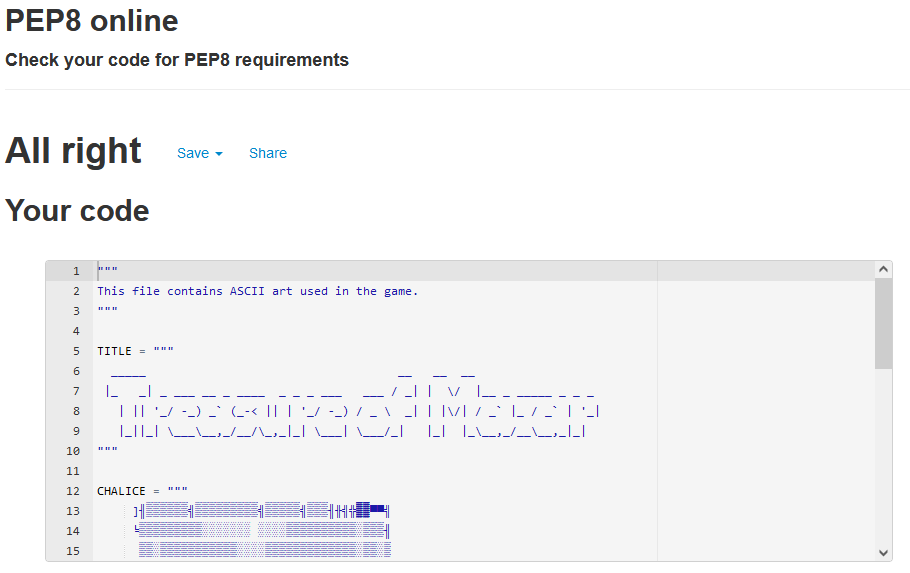

<h1 align="center">Treasure of Mazar</h1>

## Introduction
Treasure of Mazar is a Python based text adventure game designed for a command line interface (CLI). In the Treasure of Mazar, the player must adventure through an ancient tomb to claim the fabled treasure within. There are multiple choices that the player can make to aid them in their adventure, including challenges such as riddles and puzzles. The game is aimed at users who wish to play a simple and fun text adventure with multiple paths and endings based on user choice.

[The live site can be accessed here.](https://treasure-of-mazar.herokuapp.com/)

## Table of Contents

1. [Site Goals](#site-goals)
    - [User Stories](#user-stories)
    - [Site Owner Goals](#site-owner-goals)
2. [Design](#design)
    - [Colours](#colours)
    - [Graphics](#graphics)
    - [Flow Chart](#flow-chart)
3. [Features](#features)
    - [Existing Features](#existing-features)
    - [Future Features](#future-features)
4. [Technologies](#technologies)
5. [Testing](#testing)
    - [Validator Testing](#validator-testing)
    - [Manual Testing](#manual-testing)
    - [Solved Bugs](#solved-bugs)
    - [Known Bugs](#known-bugs)
6. [Deployment](#deployment)
7. [Credits](#credits)
    - [Content](#content)

## Site Goals

### User Stories

- As a new user, I want to be able to play a text adventure game.
- As a new user, I want to know how to play the game.
- As a new user, I want to play the game without any errors.
- As a new user, I want the story to be enticing.
- As a new user, I want to progress through the game easily.
- As a returning user, I want to try different paths and decisions.
- As a returning user, I want to get different endings.

### Site Owner Goals

- As a site owner, I want to create a fun and simple text adventure game.
- As a site owner, I want to be able give the user multiple options for progression.
- As a site owner, I want the game to be easy to understand.
- As a site owner, I want the game to be replayable.
- As a site owner, I want the game to flow well from one scene to another. 

## Design

### Colours
I used mostly default colours of the CLI through the game as I didn't want to overwhelm or confuse the user with too much colour. However, I did use colours for the ASCII art and for when certain events happened, such as different characters speaking. This was done to draw the users attention to these areas and also differentiate them from the player's speech.

- __Examples:__

### Graphics
I chose to include some ASCII art in the game to make it more appealing. This was done using a free ASCII generator from the website, [patorjk](https://patorjk.com) for text, and [asciiart](https://asciiart.club/) for images. I only chose to use the ASCII art for the introduction and death screen. This was because I didn't want to overwhelm users with graphics in a text based game, and feel that imagining the situations works better than displaying graphics.

Title

Chalice

Death

### Flow Chart
I created the flow chart for the game using [Lucidchart](https://www.lucidchart.com/pages/). This helped me to plan out the flow of the game and the amount of user input that I would need to include.

Flow Chart

## Features

### Existing Features

- __Introduction__
    - This is the first thing the user is met with when they run the game.
    - It provides a title of the game and a graphic of the treasure.
    - The premise of the game is introduced and the user is asked if they wish to read the instructions.

- __Instructions__
    - Before the game starts the user is asked if they wish to view the instructions.
    - Displays instructions on how the game is played.

- __Name Choice__
    - The player is asked to choose a name for their character, allowing the story to be more personalised.
    - The player name is also displayed when the player character talks.

- __Path choices__
    - There are 5 main paths that the player can choose to take.
    - These paths are chosen when the player reaches a crossroad in the tomb.
    - Path 1 takes the player to a room with a large door.
    - Path 2 takes the player to a room filled with pots.
    - Path 3 takes the player to a cold room with an ominous presence. This can only be accessed from Path 1.
    - Path 4 takes the player to a room with a sleeping troll. This can only be accessed to path 2.
    - Path 5 takes the player to a room with lava pits. This can be accessed from both Path 1 and Path 2.

- __Player items and attributes__
    - The player can find items and obtain attributes through the game to help them progress.
    - Items and attributes are single use and allow them a guaranteed pass in a room.

- __Random Elements__
    - There are random elements in the game which can determine if a player wins or not.
    - A statue room has randomised weapon combos from a list.
    - The riddles for the door in path 1 are randomised from a list.
    - Certain actions in the game are randomised and have a chance of failing or succeeding.

- __Death Screen__
    - When the player dies the death screen is displayed.
    - An option to try again is presented to the user.

- __End Screens__
    - There are a total of 4 endings in the game.
    - Each ending displays a different end banner and title, and a different story sequence.
    - The user is asked if they wish to try again after the ending banner.

- __Input Validation__
    - All input is validated to check that it matches the options presented.
    - If an input does not match the presented options, a statement is printed asking the user to enter their choice again.
    - The users choice of name is also validated to make sure it is not too long or too short.

### Future Features

- More Paths
    - I would like to expand the game further by adding more paths for the user to choose from. This would increase replayability and increase the potential of keeping users interested in the game.

- Health and combat system
    - A health and combat system could help to make the game more fun to play. This would allow me to introduce rooms with monsters that the user can fight and could make the current random system more functional.

- More user choice
    - I would like to add more user choices during encounters in the tomb. This would allow the user more freedom and greater options during their playthrough and could encourage users to replay and try different options.

## Technologies

- Python 3.8.10 - Used as the main language for the code.
- Heroku - Used for deployment.
- [Gitpod](https://www.gitpod.io/) - Used as my code editor.
- [GitHub](https://github.com/) - Used as repository and version control.
- [Lucidchart](https://www.lucidchart.com/pages/) - Used to create flow chart.
- [patrojk](https://patorjk.com) - Used to create the title and death ASCII art text.
- [asciiart](https://asciiart.club/) - Used to create the chalice ASCII art.

## Testing

### Validator Testing

- PEP8 Validator
    - I used the [PEP8 online checker](http://pep8online.com/) to check for errors in my files and none were found.

### Manual Testing

I manually tested each aspect of the game to ensure that it functioned correctly. The following details the procedures I took to test the game and the result:

- Introduction function is called and introduction sequence plays when program is run? -> YES
- Typewriter style text display works correctly? -> YES
- User is asked if they wish to view the instructions? -> YES
- User input for instruction choice works correctly? -> YES
- Instructions display correctly? -> YES
- User is asked if they wish to begin? -> YES
- User input for begin choice works correctly? -> YES
- User is asked to enter their name? -> YES
- User input for their name works correctly? -> YES
- User name is set correctly? -> YES
- User values are set to default and random weapons are chosen correctly? -> YES

 

- Tomb area story is displayed correctly? -> YES
- User location is set correctly? -> YES
- User is asked if they wish to enter the tomb? -> YES
- User input for enter choice works correctly? -> YES
- User is asked what path they wish to take? -> YES
- User input for path choice works correctly? -> YES

 

- Path 1 story is displayed correctly? -> YES
- User location is set correctly? -> YES
- User is asked if they wish to open the door? -> YES
- User input for door choice works correctly? -> YES
- Riddle is randomised correctly? -> YES
- Riddle answer works correctly? -> YES
- Player blessing set correctly? -> YES
- Path choice called correctly? -> YES

 

- Path 2 story displayed correctly? -> YES
- User location set correctly? -> YES
- User asked if they wish to search the pots? -> YES
- User input for pot choice works correctly? -> YES
- Player knife set correctly? -> YES
- Path choice called correctly? -> YES

 

- Path 3 story displayed correctly? -> YES
- User asked if they wish to approach figure? -> YES
- User input for ghost choice work correctly? -> YES
- User asked if they wish to tell truth? -> YES
- User input for truth choice work correctly? -> YES
- Player secret set correctly? -> YES
- Feast room called correctly? -> YES

 

- Path 4 story displayed correctly? -> YES
- User asked how they wish to deal with troll? -> YES
- User given extra input if holding knife? -> YES
- User input for troll choice works correctly? -> YES
- Random chance on troll choice works correctly? -> YES
- User loses knife if used? -> YES
- Statue room called correctly? -> YES

 

- Path 5 story displayed correctly? -> YES
- User asked how they wish to cross lava? -> YES
- User input for lava choice work correctly? -> YES
- User given extra input if blessing True? -> YES
- User loses blessing if used? -> YES
- Random chance on lava choice works correctly? -> YES
- Feast room called correctly? -> YES

 

- Statue room story displayed correctly? -> YES
- Random weapon combo works correctly? -> YES
- User asked to choose weapon? -> YES
- User input for statue choice work correctly? -> YES
- Key room called correctly? -> YES

 

- Key room story displayed correctly? -> YES
- User asked if they wish to take key? -> YES
- User input for key choice works correctly? -> YES
- Player Key is set to true if taken? -> YES
- Chest room called correctly? -> YES

 

- Feast room story displayed correctly? -> YES
- Player blessing checked correctly? -> YES
- Food choice skipped if player has blessing? -> YES
- User asked to choose a food to eat? -> YES
- User input for food choice works correctly? -> YES
- Random chance on food choice works correctly? -> YES
- User asked if they wish to keep eating? -> YES
- User input for eating choice works correctly? -> YES
- Player blessing is lost? -> YES
- Chest room is called correctly? -> YES

 

- Chest room story displayed correctly? -> YES
- Player key checked correctly? -> YES
- User asked if they wish to open chest? -> YES
- User input for chest choice works correctly? -> YES
- Guaranteed success to open if user has key? -> YES
- Player loses key on chest open? -> YES
- Random chance on chest choice works correctly? -> YES
- Player secret checked correctly? -> YES
- User asked how they wish to escape? -> YES
- User input for escape choice works correctly? -> YES
- Additional user input given if player secret true? -> YES
- Random chance on escape choice works correctly? -> YES
- End 4 called correctly? -> YES

 

- All endings called correctly? -> YES
- Try again called correctly? -> YES
- Death called correctly? -> YES
- User input for Try again works correctly? -> YES
- User prompted to enter input again on all invalid entries? -> YES

### Solved Bugs

- Sometimes the input requests from different paths would randomly pop up when restarting the game and running it again. I managed to solve this by adding a Return statement at the end of functions.
- The random weapon combos for the statue room were not randomising again when pressing try again. I resolved this by randomising them at the start of the game.

### Known Bugs

- One known bug is that when entering input in the terminal when it is not requested, the next input check will return invalid and ask the player to enter their input again. This can also break the typing sequence when the story is being told, causing it to become unreadable. 

## Deployment

I deployed my site to Heroku with Code Institute's Python terminal using the following steps:
  1. Create and sign into an account on [Heroku.com](https://www.heroku.com/)
  2. Select 'Create a New app' and choose a name for your app
  3. Select your region and then click 'Create app'
  4. Go to the 'Settings' tab and click 'Reveal config vars'
  5. In the 'KEY' field add 'PORT' and in the 'VALUE' field add '8000' and click 'add'
  6. Click 'Add buildpack' and choose 'Python' and save, and then do the same with 'Node'
  7. Go to the 'Deploy' tab and connect your github account
  8. Search for your project repository and click 'connect'
  9. From 'Automatic Deploys' you can choose to setup automatic deploys so that everytime code pushed to github, Heroku will rebuild the app
  10. From 'Manual Deploy' Select the branch you wish to deploy and then click 'Deploy Branch'
  11. When Heroku has finished building the app, a link will be provided to open the app

## Credits

### Content

- [Code Institute course material](https://codeinstitute.net/)
- Tutorials on how to use colorama by [Tech With Tim](https://www.youtube.com/watch?v=u51Zjlnui4Y)
- Information for how to use various variables and elements by [W3Schools](https://www.w3schools.com/)
- Typing text effect code by [101Computing](https://www.101computing.net/python-typing-text-effect/)
- ASCII art converters by [asciiart](https://asciiart.club/) and [patrojk](https://patorjk.com)
